<!-- Cover Image -->

  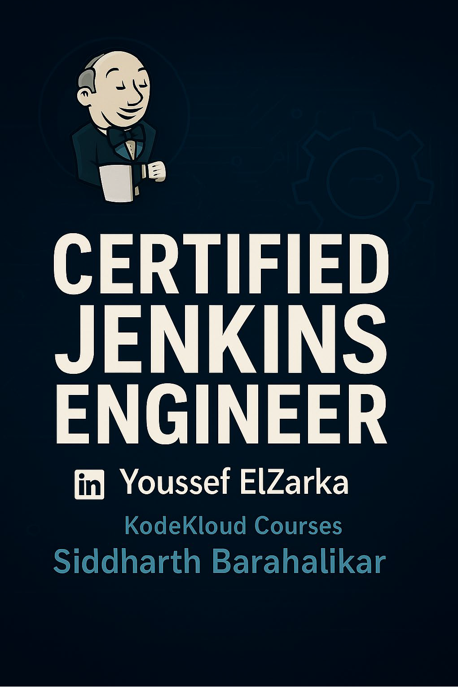

<h1 align="center">✨ Certified Jenkins Engineering (KodeKloud) ✨</h1>

Master Jenkins with the summary of the <strong>Jenkins CI/CD Pipeline</strong> based on <a href="https://kodekloud.com/">KodeKloud</a> and hands-on training in building, automating, and managing end-to-end CI/CD pipelines. Gain practical expertise in pipelines, integrations, and DevOps best practices to streamline software delivery. This repository organizes concepts, diagrams, and examples in a clear and structured manner.

 > ⚠️ **Important:** The PDF version of this course summary contains **all concepts in full detail** and is highly recommended for comprehensive study.

  

  
  
  
  

> 💡 **Tip:**  
> To view the full-resolution version of this document, click the **Download PDF** badge above.  
> It will take you to the original file hosted on Google Drive.

---

## 📑 Table of Contents

 

 

 

 

 

 
 

---

## 🌐 Chapter1: Introduction

Click to Expand 🔽

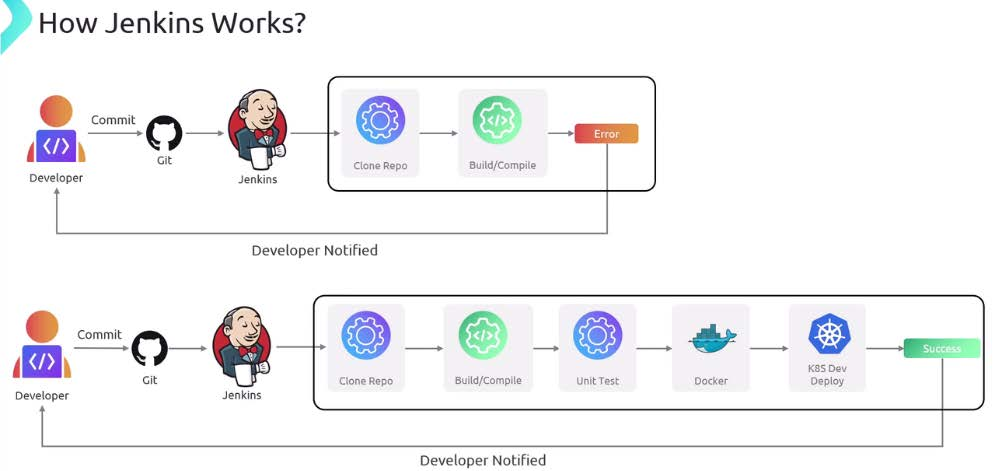

- Introduction to Jenkins  
- Problem Statement  
- Intro To Jenkins  
- Basics of SCM  
- SCM Technology  
- Basics of CI/CD  
- Software Testing  

---

## 📦 Chapter2: Jenkins setup and interface

Click to Expand 🔽

- Jenkins Architecture  
- Jenkins Installation Options  
- Demo: Initial Settings & JVM Tuning  
- Running Jenkins WAR as a standalone App  
- Jenkins User Interface Overview  
- System Settings  
- Build Timeout & Timestamp  
- Jenkins Project & Freestyle Jobs  
- Chained Freestyle Projects  

---

## 🛠️ Chapter3: Extending Jenkins and administration

Click to Expand 🔽

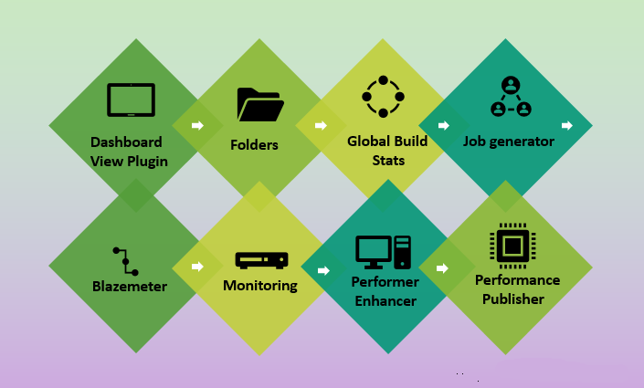

- Jenkins Plugins Overview  
- Installing Plugins  
- Managing Plugins  
- Managing Old Data  
- Reload Configuration from Disk  
- Controller Failure – Freestyle Project  
- Jenkins Fingerprints  

---

## 🛠️ Chapter4: Jenkins Pipelines

Click to Expand 🔽

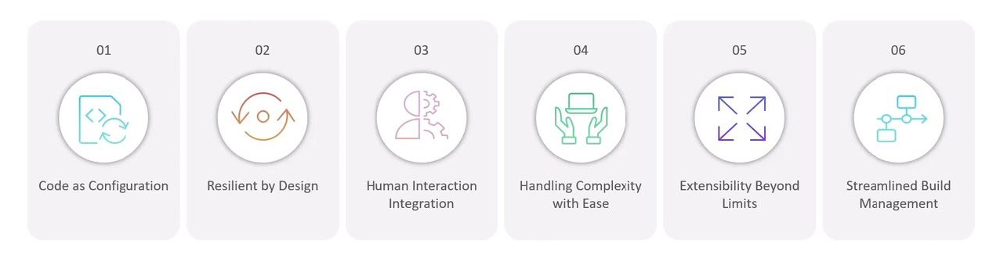

- Pipeline and Jenkinsfile  
- Additional Pipeline Configuration  
- Simple Pipeline Job  
- Build & Test via Pipeline  
- Pipeline Script from SCM  
- Controller Failure – Pipeline Project  
- Create Pipeline using Blue Ocean Graphical Editor  
- Create Pipeline with Parameters  

---

## 🔐 Chapter5: Automation and Security

Click to Expand 🔽

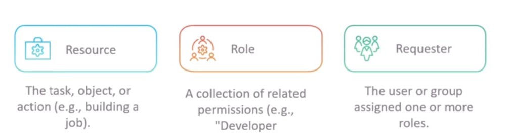

- Automating Jenkins using CLI and APIs  
- Jenkins CLI: Build a Job  
- Jenkins REST API: Install a Plugin  
- Jenkins CSRF - CRUMB  
- Jenkins Security Overview & Authentication  
- Authentication-Matrix Authorization Strategy  
- Jenkins CLI-SSH Authentication  
- Built-in Email Notification & Email Extention Notification  

---

## ⚙️ Chapter6: Setting up CI Pipeline

Click to Expand 🔽

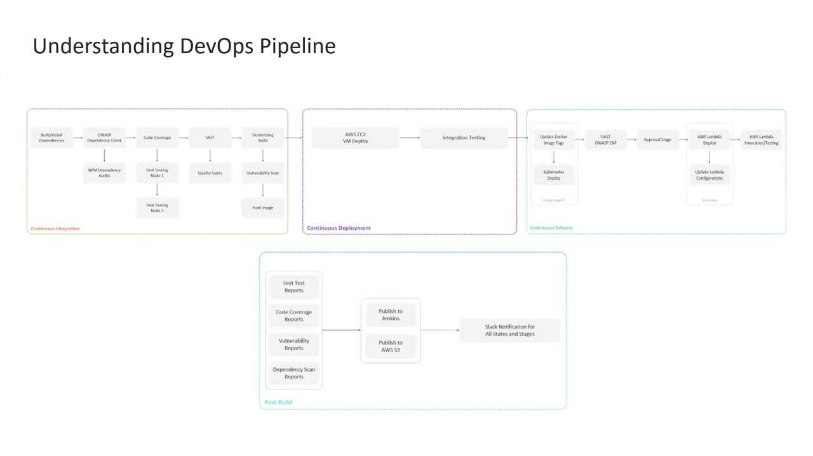

- NodeJS App Overview  
- Run and Test NodeJS App on Local Machine  
- Understanding DevOps Pipeline  
- Install & Setup NodeJS Build Tool  
- Organization Folder Project in Jenkins  
- Add Jenkinsfile to Repository  
- Install dependencies  
- Setup and Run Dependency Scanning  
- Fixing Vulnerabilities & Publish HTML Report  
- Unit Testing and Analyze JUnit Reports  
- Using Option Directive  

---

## 🧪 Chapter7: Code Quality and Testing

Click to Expand 🔽

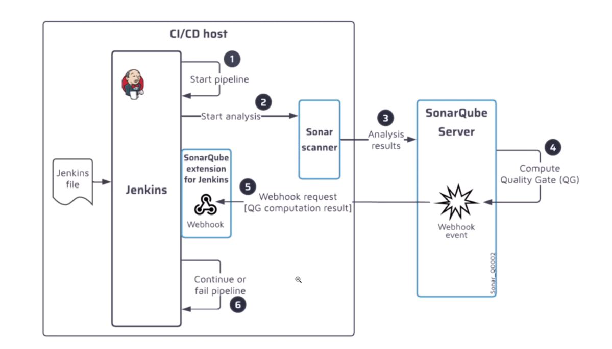

- Code Coverage and Catch Errors  
- Refactoring Jenkinsfile  
- String Interpolation  
- SonarQube Introduction / SAST  
- SAST Analysis  
- SonarQube Quality Gate Step and Refactoring  

---

## 📦 Chapter8: Containerization and Deployment

Click to Expand 🔽

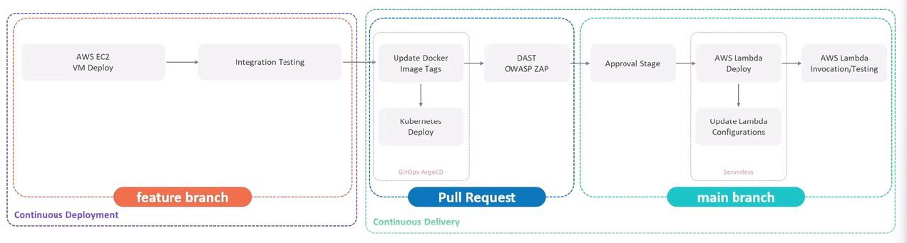

- Build Docker Image  
- Vulnerability Scan using Trivy  
- Push To Registry  
- Understanding Deployment Approach  
- Exploring AWS and Setting up Jenkins Instance  
- Build-in When Condition  
- Deploy AWS EC2  
- Integration Testing - AWS EC2  

---

## 🌉 Chapter9: Kubernetes and GitOps

Click to Expand 🔽

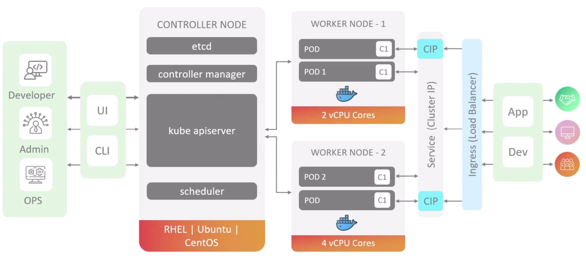

- Kubernetes Overview  
- Introduction to GitOps  
- Jenkins vs. ArgoCD  
- ArgoCD Concepts & Terminology  
- CI/CD with GitOps  
- Manifest Repository & Configure ArgoCD  
- K8s Deploy-Update Image Tag  
- K8s Deploy-Raise PR  
- Integration between Jenkins & ArgoCD  
- DAST & Manual Input  
- DAST Ignore Rules  
- Publish Reports to AWS S3  
- Deploy to Prod  

---

## ⚡ Chapter10: AWS Lambda and advanced Deployment Techniques

Click to Expand 🔽

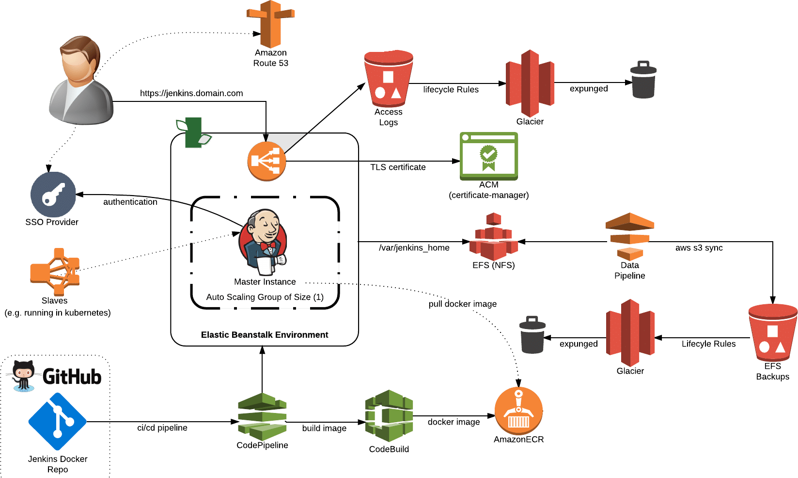

- AWS Lambda Basics  
- Using GenAI to Generate Steps for Lambda Deployment  
- Manual Lambda Deployment  
- Example on Solar System App  
- Lambda Deployment Using Jenkinsfile  
- Update Lambda Configuration  
- Lambda-Invoke Function  

---

## 🩺 Chapter11: Jenkins Administration and Monitoring (part1)

Click to Expand 🔽

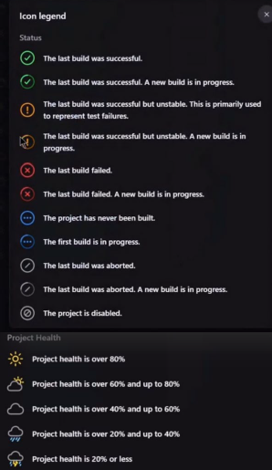

- Jenkins Folder (Part1 to Part4)  
- Script Console  
- Global Security Settings  
- Markup Formatters in More Details  
- Access Control for Builds  
- Job Restrictions  
- Job Configuration History Plugin  
- Build Monitor View  
- Jenkins Scaling Capacity Planning  
- Monitoring using Java Melody  
- Slack Notification Setup  

---

## 📚 Chapter12: Shared Libraries in Jenkins

Click to Expand 🔽

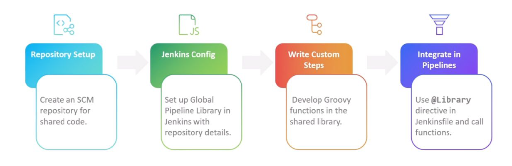

- Introduction to Shared Library  
- Refactor Existing Jenkinsfile  
- Create a Shared Library for Slack Notification  
- Configure Shared Library in Jenkins  
- Loading the Shared Library in Pipeline  
- Create Shared Library for Trivy Scan  
- Load Trivy Scan Library in Jenkins Pipeline  
- Library Resource Management  

---

## 🧩 Chapter13: Agent and Nodes In Jenkins

Click to Expand 🔽

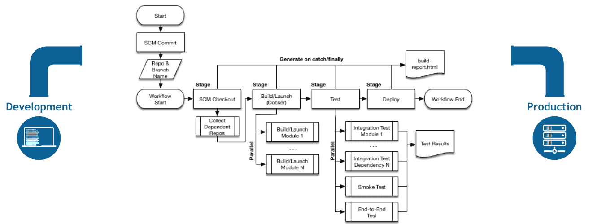

- Types of Agents  
- Create and Configure Node  
- Utilize Agents in Jobs  
- Utilize Docker Image Agent  
- Utilize Dockerfile Agent  
- Utilize NewContainerPerStage  
- Configure Cloud Instance - Kubernetes  
- Utilize K8S Pod as Agent  

---

## 🔄 Chapter14: Pipeline Enhancement and Caching

Click to Expand 🔽

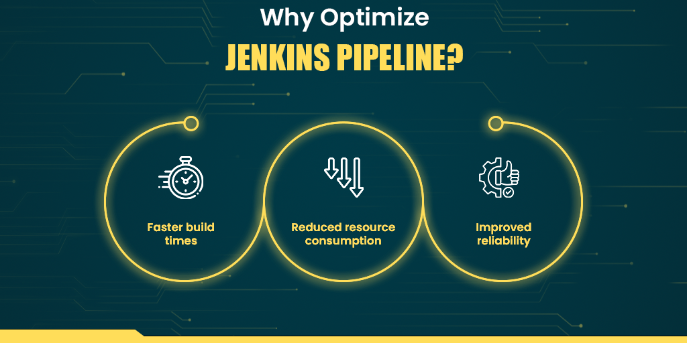

- Sharing Files Between Containers  
- Refactoring Solar System Pipeline  
- Refactoring Unit Test Stage  
- Sequential Stages  
- Stash and Unstash  
- Pipeline Caching  
- Invalidate Cache  

---

## 📊 Chapter15: Pipeline Structure and Scripted vs. Declarative

Click to Expand 🔽

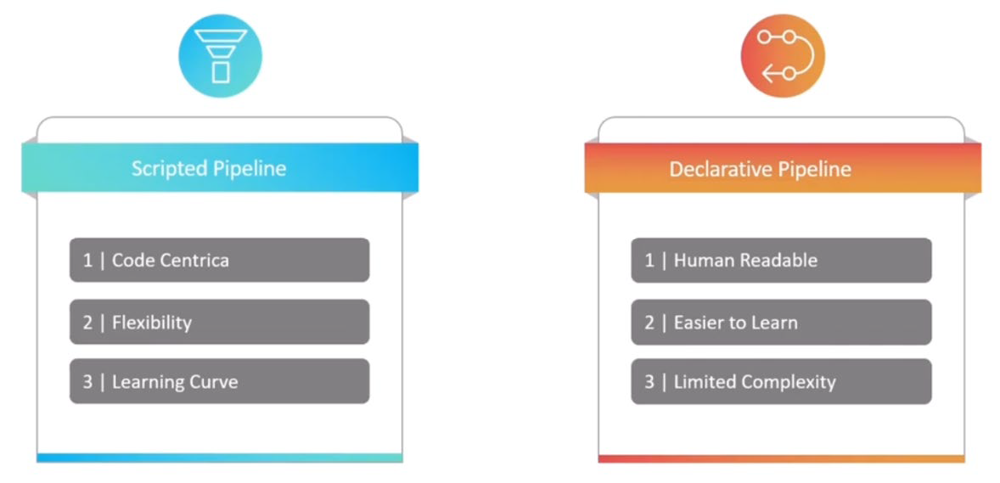

- Declarative vs Scripted Pipeline  
- Demo Declarative vs Scripted Pipeline  
- Post Section in Declarative Pipelines vs Finally Block in Scripted Pipelines  
- Reversing Stash in Declarative Pipeline  
- Scripted Pipeline Initialize  
- Scripted Pipeline-Static Agent  
- Scripted Pipeline-K8S Agent  
- Best Practices for Scripted Pipelines  

---

## 🧩 Chapter16: Jenkins Administration and monitoring (part2)

Click to Expand 🔽

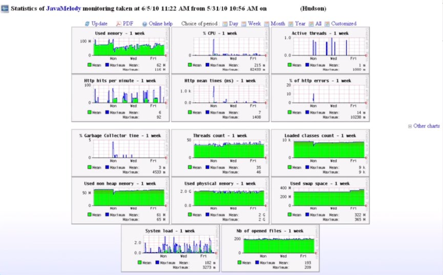

- Jenkins Supervision  
- Monitoring with Prometheus & Grafana  
- Log Recorder  
- Install & Configure Audit Trail  
- Forward Audit Logs to External Server like Elastic Cloud  
- Groovy Sandbox and In-Process Script Approval  
- Demo Groovy Sandbox (Part1-3)  
- Migrate Jenkins to Another Node  

---

## 💾 Chapter17: Backup and Configuration Management

Click to Expand 🔽

- GitHub Action Basics  
- Migrating Jenkins Pipeline to GitHub Action  
- Backing-Up & Restoring Jenkins  
- Demo Backing-Up & Restoring Jenkins (Thin Backup Plugin)  
- Validating Backup with Only Linux  
- Upgrading Jenkins  
- Jenkins Configure as Code (JCasC)  
- Demo Configure and Explore (JCasC)  
- Real Example on JCasC (Creating a Job) & YAML  
- Pipeline Durability  

---

## ⚠️🎀 Important Notes

💎You can consider that this summary includes (3) main courses for Jenkins:
  - Jenkins for beginners .. chapters (1 : 5)
  - Jenkins Pipeline project .. chapters (6:11)
  - Advanced Jenkins .. chapters (12:17)

    
⚡It is highly recommended that you review the documentationfor any of the following:
  - Jenkins plugins
  - Code used within stages and steps (Jenkinsfile)
  - Third-party tools (Trivy, SonarQube, ArgoCD….)

   

